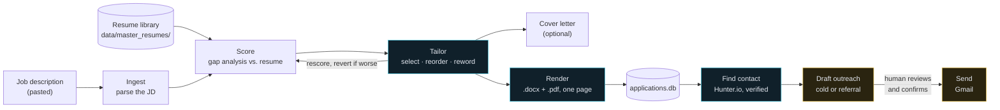

# Resume Builder Agent

A personal job-application pipeline: paste a job description, and it scores it against your resume, generates a tailored resume + cover letter, finds a verified hiring contact, drafts outreach, and tracks everything in a local database — with a review-and-approve step before anything is ever sent.

Every agent is a small, single-purpose Python function — most call the Anthropic API directly; contact discovery calls Hunter.io instead. No framework, no autonomous loop. The interesting engineering isn't the prompts; it's the guardrails wrapped around them that make the output trustworthy enough to actually send.

**Contents:** [Why not just a chat window](#why-this-instead-of-just-pasting-into-a-chat-window) · [How it works](#how-it-works) · [A guardrail, concretely](#a-guardrail-concretely) · [Features](#features) · [Setup](#setup) · [CLI usage](#using-it-from-the-command-line-instead) · [Design docs](#project-structure-and-design-docs) · [Testing](#testing) · [Tech stack](#tech-stack)

## Why this instead of just pasting into a chat window

The model capability is the same either way. What this adds:

- **Guardrails enforced in code, not just prompted.** Tailoring and cover-letter generation can only reorder, filter, or lightly reword your real resume content — fabricated metrics, dropped technical detail, and unsupported claims are caught and reverted (or retried) by code, not by hoping the prompt holds.
- **A structured source of truth.** Your resume lives as tagged, structured data (`data/master_resumes/`), not prose re-typed into a chat every time.
- **Everything is tracked.** Every generated resume/cover letter version, every score, every contact, and every outreach draft is logged to a local SQLite database and never silently overwritten.
- **Nothing sends itself.** Outreach emails land in a review queue and only go out on an explicit, confirmed click.

Chat is simpler for a single one-off application. This is for repetition and volume.

## How it works



Every stage takes structured JSON in and returns structured JSON out — no shared memory, no hidden state, each one independently testable. Tailoring is the only stage that loops back on itself: it rescores its own output, and if the "improved" resume actually scores *lower* than your original, the whole pass is discarded and your unmodified resume is used instead. That's enforced in code, not a best-effort heuristic — it physically cannot ship a worse result than doing nothing.

## A guardrail, concretely

It's easy to say "never fabricates." Here's an actual case this project hit and fixed. A resume bullet read:

> "Improved ML model prediction accuracy 35% for **a turfgrass disease outbreak research project** by cleaning and preparing a 50,000+ entry structured dataset..."

Left alone, one tailoring pass reworded it down to:

> "Improved ML model prediction accuracy 35% for **a research project** by cleaning and preparing..."

Nothing here is technically false — the number's untouched, no skill was invented. But it quietly deleted the one detail that made the work specific and memorable. The fix isn't a better prompt (the prompt already explicitly bans this, with this exact example, and it still wasn't reliable). It's a structural check: extract multi-word, non-generic phrases from the original bullet, and if a reword drops the majority of a phrase's words, the system gives the model one targeted retry ("you dropped this specific detail, put it back"), re-checks the retry against *every* guardrail again, and only falls back to the original wording if the retry still fails. See `agents/tailor.py`'s `_dropped_phrases`/`_attempt_bullet_retry` and `LEARNING_LOG.md` section 22 for the full story, including a real bug the first version of this check had.

## Features

- **Score** a job description against your resume (hard/nice-to-have gap analysis)
- **Tailor** your resume for a specific role — Honest mode (selection/reordering only, bullet text locked) or Aggressive mode (also rewords, still 100% non-fabricating)
- **Generate a cover letter** — every claim is cited back to a real resume bullet and verified in code
- **Render** to `.docx` and `.pdf`, laid out to fit one page automatically, no content ever dropped to force the fit
- **Find a verified hiring contact** for the company (Hunter.io), with relevance boosting for HR/department matches and named-in-JD hiring managers
- **Draft outreach** (cold or referral-ask), editable before sending
- **Send** via your own Gmail account, with attachments verified present before anything goes out
- **A named resume library** — upload as many resumes as you want, pick which one to use per application, see which one was used on every past application
- **A review dashboard** (React + FastAPI) to run the whole pipeline and review every stage

## Setup

**Requirements:** Python 3.10+ (the strictest floor among dependencies — FastAPI and the Anthropic SDK both require it), Node 20.19+ or 22.12+ (Vite 8's own requirement), an [Anthropic API key](https://console.anthropic.com/).

```bash
git clone <this-repo>
cd Resume_Builder_Tool
python3 -m venv .venv && source .venv/bin/activate
pip install -r requirements.txt
cp .env.example .env   # fill in ANTHROPIC_API_KEY at minimum
```

Start the backend and frontend:

```bash
cd review/backend && uvicorn main:app --reload --port 8000
```

```bash
cd review/frontend && npm install && npm run dev
```

Open `http://localhost:5173`. On first run, go to the dashboard's **Resume** page and upload your resume — it gets parsed, you review the draft, and confirm before it's saved. Nothing about this tool works without that step; there's no resume checked into the repo.

`HUNTER_API_KEY` (contact discovery) and `GMAIL_ADDRESS`/`GMAIL_APP_PASSWORD` (sending) are optional — the pipeline runs fully without them, those two features just won't be available. See `.env.example` for where to get each.

## Using it from the command line instead

Every stage is also a standalone script — see `CLAUDE.md`'s Commands section for the full list. The full pipeline:

```bash
python apply.py --jd-file path/to/jd.txt --resume data/master_resumes/main.yaml
```

## Project structure and design docs

```
apply.py            orchestrator: ingest -> score -> tailor -> render -> log
agents/              one pure function per pipeline stage (JSON in, JSON out)
render/              docx + pdf rendering, one-page layout search
review/backend/      FastAPI: wraps the pipeline as a job-polling REST API
review/frontend/     React dashboard: paste-JD-to-review
data/                schema.sql (tracked) + the resume library/DB themselves (gitignored, personal data)
tests/               54 mocked regression tests, one file per guardrail-bearing module
```

- **`ARCHITECTURE.md`** — data model, every pipeline stage, guardrails, tech stack
- **`CLAUDE.md`** — day-to-day operating rules and the full command reference
- **`ROADMAP.md`** — what's built, what's next
- **`LEARNING_LOG.md`** — a teaching-voice log of real bugs found and design decisions made while building this, written as the author learned agent-building alongside the project

## Guardrails, briefly

1. Tailoring/cover-letter agents may only reorder, filter, or lightly reword existing resume content — never fabricate experience, metrics, or skills.
2. No email is ever sent without landing in a review queue first and getting explicit approval.
3. Contact discovery only uses verified sources (Hunter.io API) — no scraping.
4. Every generated resume/cover-letter version is saved and linked to its application, never silently overwritten.
5. Unverified contacts are visibly flagged as unverified, never treated as equal to verified ones.

Full detail in `ARCHITECTURE.md`.

## Testing

```bash
python -m pytest tests/
```

54 tests, fully mocked, no API calls, runs in under a second. Covers every guardrail above.

## Tech stack

Python (agents, orchestration) · SQLite (`applications.db`) · YAML (resume source of truth) · FastAPI + React/Vite/TypeScript/Tailwind (review dashboard) · `python-docx` + `reportlab` (independent docx/pdf renders) · Hunter.io (verified contact lookup) · Gmail SMTP (sending). Full detail and rationale for each choice in `ARCHITECTURE.md` section 4.

## License

MIT — see `LICENSE`.
